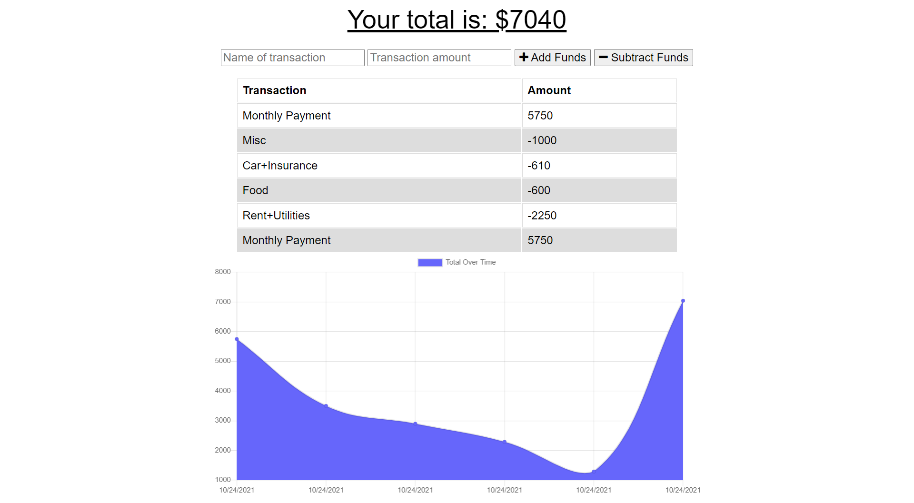

# Budget Tracker
<a href='https://opensource.org/licenses/MIT'></a>
  
## Table of Contents
- [Description](#Description) 
- [Installation](#Installation) 
- [Usage](#Usage) 
- [License](#License) 
- [Questions](#Questions)

## Description
This downloadable application was created to help its user keep track of their funds. The user can input a value and give it a name, and select whether that transaction represents an expense or an addition to their funds.

## Installation
- To download this application from your desktop, you may click the `install` icon in the url and then click on the "install" button that appears.
- To download app from an iphone, you may click on the "share" button (looks like a square with an arrow that points up), then look for the "Add to Home Screen" option and click on it. 

## Usage
User interaction with this application boils down to choosing a name and value for a new transaction, then selecting whether it represents an addition or subtraction of funds. 
 
You may access the deployed application through this link: https://budget-tracker-padredilg.herokuapp.com/
  
</img>

## License
This application is covered under the <a href='https://opensource.org/licenses/MIT'>MIT License</a>

## Questions
<a href='https://github.com/Padredilg'>Padredilg</a> 
If you have any questions, you may email at padredilg@knights.ucf.edu

